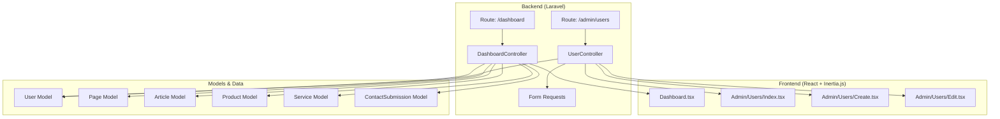

# Dokumen Desain Teknis: Admin Dashboard Redesign

## Overview

Fitur ini mencakup redesain dashboard admin dan penambahan modul CRUD User Management pada panel admin website Naren Laptop. Arsitektur mengikuti pola yang sudah ada di project: Laravel backend dengan Inertia.js sebagai bridge ke React frontend, tanpa API terpisah.

**Keputusan arsitektural utama:**
- Menggunakan Inertia.js untuk pengalaman SPA (semua data dikirim sebagai props)
- Mengikuti pola controller yang sudah ada (ArticleController, ContactSubmissionController)
- Menggunakan model User yang sudah ada tanpa migrasi tambahan
- Dashboard stats dihitung di controller dan dikirim sebagai Inertia props
- User CRUD mengikuti pola resource controller yang sama dengan admin resources lainnya

## Architecture



### Alur Data

1. **Dashboard**: Route `/dashboard` → `DashboardController@index` → mengumpulkan stats dari semua model → render via Inertia ke `Dashboard.tsx`
2. **User CRUD**: Route group `/admin/users` → `UserController` (resource) → validasi via Form Request → operasi CRUD pada model User → render via Inertia

### Middleware

Semua route admin menggunakan middleware `['auth', 'verified']` yang sudah ada, sesuai pola di `routes/web.php`.

## Components and Interfaces

### Backend Components

#### 1. DashboardController (Refactor)

Memindahkan logic dashboard dari closure di `web.php` ke controller dedicated.

```php
// app/Http/Controllers/Admin/DashboardController.php
class DashboardController extends Controller
{
    public function index(): Response
    {
        return Inertia::render('Dashboard', [
            'stats' => $this->getStats(),
            'messageTrend' => $this->getMessageTrend(),
            'recentPages' => Page::latest('updated_at')->take(5)->get(['id','title','slug','status','updated_at']),
            'recentArticles' => Article::latest('updated_at')->take(5)->get(['id','title','slug','status','updated_at']),
            'recentMessages' => ContactSubmission::latest()->take(3)->get(['id','name','message','created_at','read_at']),
            'unreadMessages' => ContactSubmission::whereNull('read_at')->count(),
        ]);
    }

    private function getStats(): array { /* ... */ }
    private function getMessageTrend(): array { /* ... */ }
}
```

#### 2. UserController (Baru)

```php
// app/Http/Controllers/Admin/UserController.php
class UserController extends Controller
{
    public function index(Request $request): Response    // Daftar + search + paginasi
    public function create(): Response                   // Form tambah
    public function store(StoreUserRequest $request): RedirectResponse  // Simpan user baru
    public function edit(User $user): Response           // Form edit
    public function update(UpdateUserRequest $request, User $user): RedirectResponse  // Update user
    public function destroy(Request $request, User $user): RedirectResponse  // Hapus user
}
```

#### 3. Form Requests (Baru)

```php
// app/Http/Requests/StoreUserRequest.php
class StoreUserRequest extends FormRequest
{
    public function rules(): array
    {
        return [
            'name' => ['required', 'string', 'max:255'],
            'email' => ['required', 'email', 'max:255', 'unique:users,email'],
            'password' => ['required', 'string', 'min:8', 'confirmed'],
        ];
    }
}

// app/Http/Requests/UpdateUserRequest.php
class UpdateUserRequest extends FormRequest
{
    public function rules(): array
    {
        return [
            'name' => ['required', 'string', 'max:255'],
            'email' => ['required', 'email', 'max:255', 'unique:users,email,' . $this->user->id],
            'password' => ['nullable', 'string', 'min:8', 'confirmed'],
        ];
    }
}
```

### Frontend Components

#### 1. Dashboard.tsx (Refactor)

Refactor halaman Dashboard yang sudah ada dengan penambahan:
- Stat cards baru: total produk, total layanan, total pengguna
- Grafik tren pesan 7 hari terakhir (menggunakan simple bar chart)
- Contact Widget dengan 3 pesan terbaru dan badge unread
- Quick actions tambahan: pengguna, layanan, media, pengaturan

#### 2. Admin/Users/Index.tsx (Baru)

Halaman daftar pengguna mengikuti pola `Admin/Messages/Index.jsx`:
- Tabel dengan kolom: nama, email, tanggal bergabung, aksi
- Search bar untuk filter nama/email
- Paginasi 15 item per halaman
- Tombol "Tambah Pengguna"
- Tombol edit dan hapus per baris

#### 3. Admin/Users/Create.tsx (Baru)

Form pembuatan pengguna:
- Field: nama, email, password, konfirmasi password
- Validasi error ditampilkan per field
- Submit redirect ke index dengan flash message

#### 4. Admin/Users/Edit.tsx (Baru)

Form edit pengguna:
- Field: nama, email (pre-filled), password (opsional), konfirmasi password
- Password kosong = tidak diubah
- Validasi error ditampilkan per field

### Routes (Penambahan)

```php
// Di dalam group admin middleware(['auth', 'verified'])
Route::resource('users', UserController::class)->except(['show']);
```

Dashboard route akan diubah dari closure menjadi:
```php
Route::get('/dashboard', [DashboardController::class, 'index'])
    ->middleware(['auth', 'verified'])
    ->name('dashboard');
```

## Data Models

### User Model (Sudah Ada - Tanpa Perubahan)

| Field | Type | Keterangan |
|-------|------|-----------|
| id | bigint (PK) | Auto increment |
| name | string | Nama pengguna |
| email | string | Email (unique) |
| email_verified_at | timestamp | Waktu verifikasi |
| password | string | Password (hashed) |
| remember_token | string | Token remember me |
| created_at | timestamp | Tanggal bergabung |
| updated_at | timestamp | Terakhir diperbarui |

**Catatan**: Tidak diperlukan migrasi database karena model User dan tabel `users` sudah ada.

### Data yang Dikirim ke Dashboard (Inertia Props)

```typescript
interface DashboardProps {
    stats: {
        pages: number;
        publishedPages: number;
        articles: number;
        publishedArticles: number;
        products: number;
        services: number;
        messages: number;
        users: number;
    };
    messageTrend: Array<{ date: string; count: number }>; // 7 hari terakhir
    recentPages: RecentItem[];
    recentArticles: RecentItem[];
    recentMessages: RecentMessage[];
    unreadMessages: number;
}

interface RecentMessage {
    id: number;
    name: string;
    message: string;
    created_at: string;
    read_at: string | null;
}
```

### Data yang Dikirim ke User Index (Inertia Props)

```typescript
interface UserIndexProps {
    users: PaginatedData<UserItem>;
    filters: { search?: string };
}

interface UserItem {
    id: number;
    name: string;
    email: string;
    created_at: string;
}
```

## Correctness Properties

*Correctness property adalah karakteristik atau perilaku yang harus selalu benar di semua eksekusi valid dari sistem — pada dasarnya, pernyataan formal tentang apa yang seharusnya dilakukan sistem. Properties berfungsi sebagai jembatan antara spesifikasi yang dapat dibaca manusia dan jaminan kebenaran yang dapat diverifikasi mesin.*

### Property 1: Akurasi Statistik Dashboard

*For any* state database (jumlah pages, articles, products, services, messages, users berapapun), stats yang dikembalikan oleh DashboardController harus sama persis dengan hasil query count langsung ke masing-masing tabel.

**Validates: Requirements 1.1, 4.1, 4.2, 4.3**

### Property 2: Akurasi Tren Pesan 7 Hari

*For any* kumpulan contact submissions dengan tanggal created_at yang bervariasi, array messageTrend harus berisi tepat 7 elemen, masing-masing dengan count yang sesuai dengan jumlah pesan yang dibuat pada hari tersebut.

**Validates: Requirements 1.2**

### Property 3: Urutan Aktivitas Terbaru

*For any* kumpulan pages dan articles dengan updated_at yang bervariasi, recentPages dan recentArticles harus mengembalikan tepat 5 item (atau kurang jika total < 5) dalam urutan descending berdasarkan updated_at.

**Validates: Requirements 1.3**

### Property 4: Format Angka Ribuan

*For any* angka integer positif di atas 999, fungsi format angka harus menghasilkan string dengan pemisah titik setiap 3 digit dari kanan (format Indonesia: 1.000, 10.000, 1.000.000).

**Validates: Requirements 1.7**

### Property 5: Persistensi User Baru

*For any* data user valid (name non-empty, email valid dan unik, password min 8 karakter), setelah store berhasil, user harus ada di database dengan name dan email yang sama, serta password yang ter-hash.

**Validates: Requirements 2.3**

### Property 6: Penegakan Keunikan Email

*For any* user yang sudah ada di database, percobaan membuat user baru dengan email yang sama ATAU mengubah email user lain ke email tersebut harus ditolak dengan error validasi.

**Validates: Requirements 2.4, 2.8**

### Property 7: Update User Mempersistkan Data Valid

*For any* user yang ada dan data update valid (name baru, email baru yang unik), setelah update berhasil, database harus mencerminkan nilai-nilai baru. Jika password tidak disertakan, password lama harus tetap tidak berubah.

**Validates: Requirements 2.6, 2.7**

### Property 8: Penghapusan Menghilangkan User dari Database

*For any* user yang ada (bukan user yang sedang login), setelah destroy berhasil, user tersebut tidak boleh lagi ditemukan di database.

**Validates: Requirements 2.10**

### Property 9: Pencegahan Hapus Diri Sendiri

*For any* user yang sedang terotentikasi, percobaan menghapus akun sendiri harus selalu ditolak, dan user harus tetap ada di database.

**Validates: Requirements 2.11**

### Property 10: Filter Pencarian User

*For any* kumpulan users dan search term apapun, semua user yang dikembalikan harus memiliki nama ATAU email yang mengandung search term tersebut (case-insensitive).

**Validates: Requirements 2.12**

### Property 11: Constraint Paginasi

*For any* jumlah users di database, setiap halaman paginasi harus berisi maksimal 15 item, dan total item di semua halaman harus sama dengan total users yang ada.

**Validates: Requirements 2.13**

### Property 12: Akurasi Hitungan Pesan Contact Widget

*For any* kumpulan contact submissions dengan read_at yang bervariasi (null = belum dibaca), unreadMessages harus sama dengan jumlah record yang memiliki read_at = null, dan total messages di stats harus sama dengan total semua record.

**Validates: Requirements 3.1**

### Property 13: Pesan Terbaru di Contact Widget

*For any* kumpulan contact submissions, recentMessages harus mengembalikan tepat 3 pesan (atau kurang jika total < 3) dalam urutan descending berdasarkan created_at, dengan field name, message, dan created_at yang benar.

**Validates: Requirements 3.4**

## Error Handling

### Backend Error Handling

| Skenario | Penanganan | Response |
|----------|-----------|----------|
| Validasi gagal (form request) | Laravel otomatis redirect back with errors | Inertia menampilkan errors per field |
| User tidak ditemukan (route model binding) | Laravel otomatis 404 | Halaman 404 |
| Hapus diri sendiri | Cek di controller, abort jika sama | Redirect back with error flash |
| Database error | Try-catch di controller | Redirect back with error flash |
| Unauthorized access | Middleware `auth` dan `verified` | Redirect ke login |

### Frontend Error Handling

- Validasi error ditampilkan di bawah masing-masing field menggunakan pattern `usePage().props.errors`
- Flash messages (sukses/error) ditampilkan sebagai toast/notification
- Konfirmasi dialog sebelum delete menggunakan `confirm()` atau komponen dialog
- Loading state pada form submit untuk mencegah double-submit

### Error Messages (Bahasa Indonesia)

```php
// StoreUserRequest & UpdateUserRequest custom messages
'name.required' => 'Nama wajib diisi.',
'email.required' => 'Email wajib diisi.',
'email.email' => 'Format email tidak valid.',
'email.unique' => 'Email sudah digunakan.',
'password.required' => 'Password wajib diisi.',
'password.min' => 'Password minimal 8 karakter.',
'password.confirmed' => 'Konfirmasi password tidak sesuai.',
```

## Testing Strategy

### Unit Tests (PHPUnit)

**Fokus**: Contoh spesifik, edge cases, error conditions.

1. **DashboardController Test**:
   - Verifikasi response berisi semua expected Inertia props
   - Verifikasi middleware authentication aktif

2. **UserController Test**:
   - Test store dengan data valid → user tersimpan
   - Test store dengan email duplikat → validasi error
   - Test update tanpa password → password tidak berubah
   - Test delete user lain → berhasil
   - Test delete diri sendiri → ditolak
   - Test index dengan search → hasil terfilter

3. **Form Request Tests**:
   - Test semua aturan validasi di StoreUserRequest
   - Test semua aturan validasi di UpdateUserRequest

### Property-Based Tests (Pest + quickcheck/faker-based approach)

**Library**: Menggunakan Pest PHP dengan custom data providers yang menghasilkan input acak. Karena PHP tidak memiliki library PBT standard seperti QuickCheck, kita akan menggunakan pattern `repeat(100)` dengan Faker untuk menghasilkan input bervariasi.

**Konfigurasi**: Minimum 100 iterasi per property test.

**Tag format**: `Feature: admin-dashboard-redesign, Property {number}: {property_text}`

Property tests yang akan diimplementasi:
- Property 1: Stats accuracy (generate random records, verify counts)
- Property 2: Message trend accuracy (generate random dates, verify daily counts)
- Property 3: Recent items ordering (generate random timestamps, verify sort order)
- Property 4: Number formatting (generate random integers, verify separator placement)
- Property 5: User creation persistence (generate random valid data, verify DB state)
- Property 6: Email uniqueness (generate random users, test duplicate scenarios)
- Property 7: User update persistence (generate random updates, verify DB state)
- Property 8: User deletion (generate random users, verify removal)
- Property 9: Self-deletion prevention (any authenticated user, verify rejection)
- Property 10: Search filtering (generate random users + queries, verify results match)
- Property 11: Pagination constraint (generate N users, verify page sizes)
- Property 12: Contact widget counts (generate random messages, verify counts)
- Property 13: Recent messages (generate random messages, verify top 3 order)

### Integration Tests

- Full page render test untuk Dashboard (semua sections visible)
- Full CRUD flow untuk User Management
- Middleware protection pada semua admin routes

### Pendekatan Frontend Testing

- Component tests menggunakan testing-library/react (jika tersedia)
- Verifikasi render Stat Cards, tabel user, form fields
- Test interaksi: search, pagination links, delete confirmation
